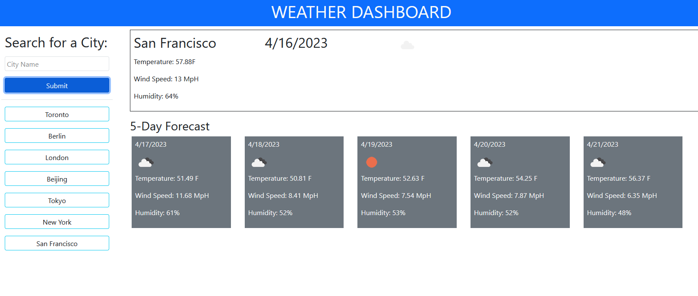
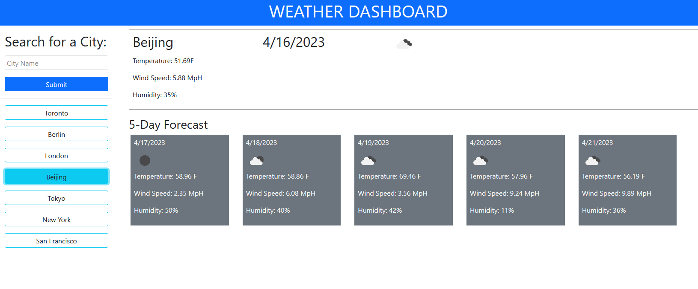

# weather-dashboard

## Description

The goal of this application is to display weather data for multiple cities for the current day as well as the next 5 days. If a user has looked up a city, that city will save so that they can see the weather data again without having to type the name in again.

## Installation

N/A

## Usage

When a user first load onto the page, it should display blank, placeholder information. When a user goes to the search bar and submits a valid city name, the weather data should populate and a button will appear below the search bar allowing the user to recall the same city's weather data at a later point.  

When a user clicks on a saved city button, then the weather data for that city will repopulate the screen.  

The weather data that will appear is as follows:
- Current Temperature %
- Current Wind Speed in MpH
- Current Humidity in %
 
The city name, current date, and an icon displaying the current weather conditions will also appear.  

The pictures below displays what the working application should look like:  
  
The above image shows what the application looks like when someone inputs city names and what the display for the weather information looks like. The bottom image shows what the application looks like when a user clicks on one of the saved city buttons.
  

## Credits

Big thanks to Peyton Castillo for helping me make sure my APIs and files were properly linked!

Not sure if I should put the APIs I used here or not, but I will for now...
jQuery - https://jquery.com/
dayjs - https://day.js.org/
OpenWeatherMap - https://openweathermap.org/
Bootstrap - https://getbootstrap.com/

## License

N/A